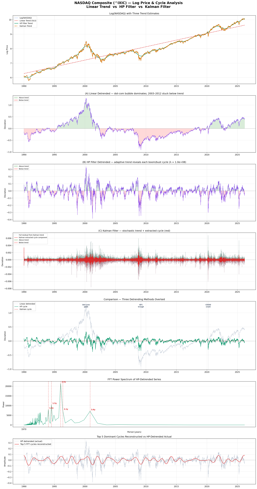
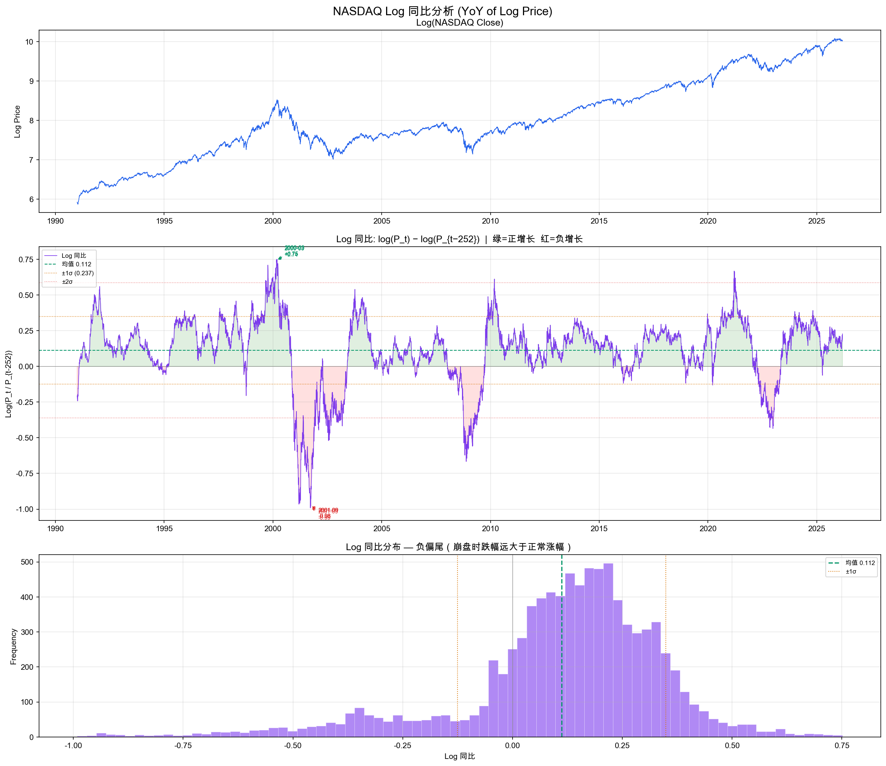
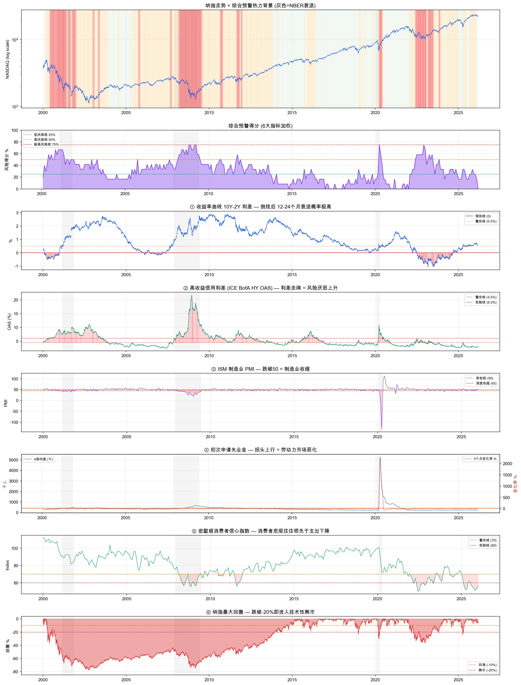
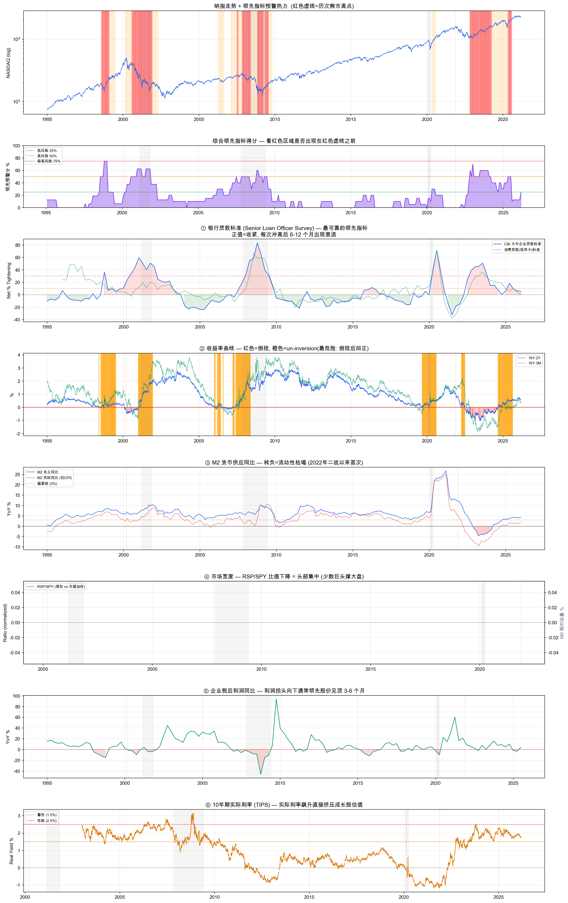

# 🐻 nasdaq-bear-radar

**NASDAQ Bear Market Early Warning System** — A quantitative toolkit that combines cycle analysis, macro indicators, and leading signals to assess whether a bear market is approaching.

> ⚠️ This is a personal research/exploration project, **not financial advice**. Use at your own risk.

---

## What This Project Does

Instead of relying on gut feeling or headlines, this project builds a data-driven bear market detection framework in three layers:

1. **Cycle & Trend Analysis** — Detrend NASDAQ log prices using Linear, HP Filter, and Kalman Filter methods, then extract dominant cycles via FFT.
2. **Bear Market Dashboard (V1)** — Score 6 coincident/lagging macro indicators against historical thresholds to produce a composite warning heatmap.
3. **Leading Indicator Dashboard (V2)** — Focus on signals that have historically led bear markets by 6–18 months, fixing V1's "too late" problem.

---

## Dashboards & Visualizations

### NASDAQ Log Price & Cycle Analysis

Three detrending methods (Linear OLS, HP Filter, Kalman Filter) applied to log NASDAQ prices since 1990. FFT power spectrum reveals dominant cycle periods (~1.3y, 1.5y, 2.0y, 2.1y, 3.8y).



### NASDAQ Log YoY Analysis

Year-over-year change of log prices with ±1σ/2σ bands. The distribution shows a clear negative skew — crashes are far more violent than rallies.



### Bear Market Warning Dashboard (V1) — 6 Indicators

Composite scoring from 6 macro indicators, each graded 0 (safe) → 1 (warning) → 2 (danger):

| # | Indicator | What It Measures |
|---|-----------|-----------------|
| ① | Yield Curve (10Y-2Y) | Inversion → recession within 12-24 months |
| ② | HY Credit Spread (ICE BofA OAS) | Widening → rising risk aversion |
| ③ | ISM Manufacturing PMI | Below 50 → manufacturing contraction |
| ④ | Initial Jobless Claims | Upturn → labor market deterioration |
| ⑤ | U. Michigan Consumer Sentiment | Pessimism leads spending decline |
| ⑥ | NASDAQ Max Drawdown | Below -20% = technical bear market |



### Leading Indicator Dashboard (V2) — True Leading Signals

V1's weakness: most indicators are coincident or lagging. V2 focuses on signals that historically **precede** bear markets:

| # | Indicator | Lead Time | Logic |
|---|-----------|-----------|-------|
| ① | Bank Lending Standards (SLOOS) | 6-12 mo | Banks tighten → credit squeeze → layoffs |
| ② | Yield Curve Un-inversion | 3-12 mo | Inversion isn't the danger — **re-steepening** is |
| ③ | M2 Money Supply YoY | 6-12 mo | Negative = liquidity drought (first since WWII in 2022) |
| ④ | Market Breadth (RSP/SPY) | 3-9 mo | Index rises but most stocks don't = topping signal |
| ⑤ | Corporate Profit Growth YoY | 3-6 mo | Profits peak before prices |
| ⑥ | 10Y Real Rate (TIPS) | 3-9 mo | Rising real rates crush growth valuations |



---

## Getting Started

### Prerequisites

```bash
pip install yfinance fredapi matplotlib scipy numpy pandas statsmodels
```

### FRED API Key

The macro dashboards pull data from [FRED](https://fred.stlouisfed.org/). You'll need a free API key:

1. Register at https://fred.stlouisfed.org/docs/api/api_key.html
2. Set your key in the notebook's `FRED_API_KEY` variable

### Run

```bash
jupyter notebook stock.ipynb
```

Run each cell sequentially. The notebook is organized into independent sections — you can run any dashboard on its own.

---

## Project Structure

```
nasdaq-bear-radar/
├── README.md
├── stock.ipynb                    # Main notebook (all analyses)
├── nasdaq_cycle_analysis.png      # Cycle & detrending output
├── nasdaq_log_yoy.png             # YoY log return analysis
├── bear_market_dashboard.png      # V1 dashboard (6 indicators)
└── bear_market_leading_v2.png     # V2 dashboard (leading indicators)
```

---

## Data Sources

- **Yahoo Finance** (`yfinance`) — NASDAQ Composite (^IXIC), S&P 500 ETFs (SPY, RSP)
- **FRED** (`fredapi`) — Yield curves, credit spreads, ISM PMI, jobless claims, consumer sentiment, M2, TIPS yields, corporate profits, Senior Loan Officer Survey

---

## Key Takeaways from the Analysis

- **Cycle extraction**: HP-detrended NASDAQ shows dominant cycles at ~2.0y and ~3.8y periods, consistent with typical business cycle frequencies.
- **Asymmetric returns**: The YoY log-return distribution has a pronounced left tail — drawdowns of -50% to -100% (log scale) have occurred, while rallies rarely exceed +75%.
- **Leading vs. lagging matters**: The V1 dashboard captures bear markets but mostly confirms what's already happening. V2's lending standards and yield-curve un-inversion signals have historically fired 6-12 months *before* major declines.

---

## License

MIT

---

## Disclaimer

This project is for **educational and research purposes only**. Nothing here constitutes investment advice. Past indicator performance does not guarantee future predictive power. Always do your own research and consult a qualified financial advisor before making investment decisions.
